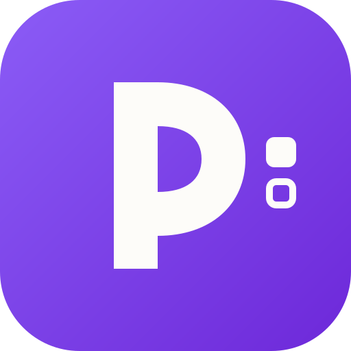
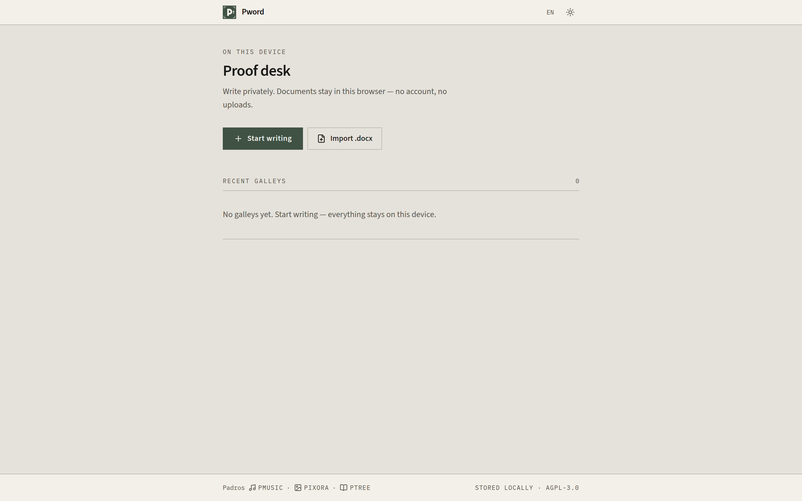
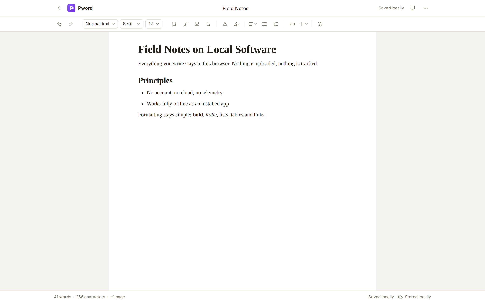
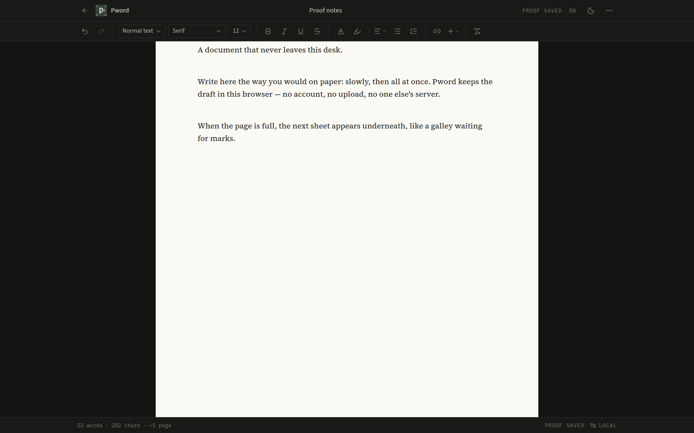
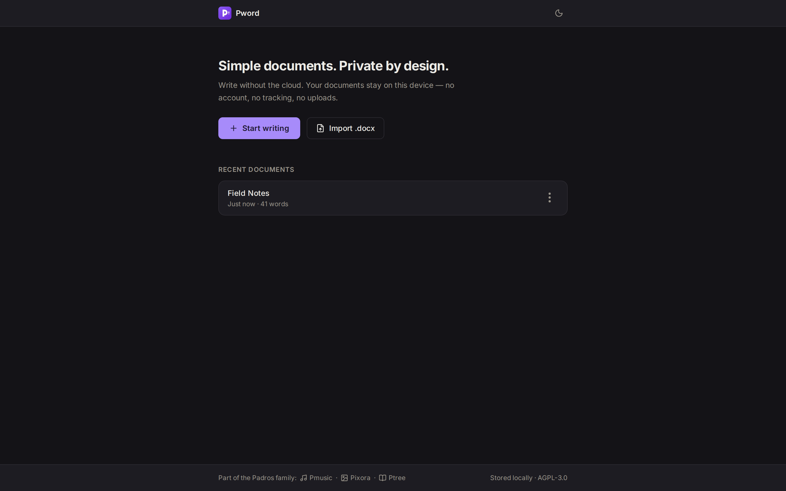

<div align="center">

[English](README.md) · **Türkçe**



# Pword

### Dökümanınız cihazınızı terk etmesin.

[](https://github.com/Padrosum/pword/actions/workflows/ci.yml)
[](LICENSE)

**Pword**, öğrenciler, yazarlar ve araştırmacılar için tasarlanmış sade ve
mahrem bir belge editörüdür. Tarayıcıda çalışır; hesap yok, bulut yok, takip yok.
Yazdığınız her şey yalnızca **sizin cihazınızda** saklanır.

[**Pword'ü Aç**](https://pword.alihankarakus.com) ·
[Nedir?](#nedir) ·
[Özellikler](#özellikler) ·
[Mimari](#mimari)

</div>

---

## Nedir?

Pword, buluta ihtiyaç duymadan çalışan bir yazma aracıdır. Açarsınız, yazmaya
başlarsınız; sekmeyi kapatır, ertesi gün geri dönersiniz ve kaldığınız yerden
devam edersiniz. Microsoft Word'ün klonu olmaya çalışmaz — hızlı, sakin ve
özgün bir yazma deneyimi sunar.

<div align="center">
  
  <p><em>Ana ekran: son belgeler, tek tıkla yazmaya başlangıç.</em></p>
</div>

<div align="center">
  
  
  <p><em>Editör: gerçek A4 sayfa görünümü · koyu temada bile kağıt gibi okunur.</em></p>
</div>

<div align="center">
  
</div>

## Özellikler

**Yazma**

- Kalın, italik, altı çizili, üstü çizili; yazı rengi ve fosforlu kalem
- Yazı tipi (Serif / Sans / Mono) ve punto seçimi
- Paragraf stilleri: Başlık, Alt başlık, H1–H3, Normal
- Hizalama: sola, ortala, sağa, iki yana
- Madde ve numaralı listeler, iç içe listeler, yapılacaklar listesi
- Bağlantı, görsel, tablo, yatay çizgi, sayfa sonu
- Gerçek A4 sayfalama: sayfalar yüksekliğe göre dolar, Word gibi alt alta akar
- Canlı kelime / karakter / sayfa sayısı

**Belgeler**

- Otomatik kaydetme (aralık bırakınca) + `Ctrl/Cmd + S` ile manuel kayıt
- Son belgeler listesi; geri döndüğünüzde kaldığınız belge açılır
- Yeniden adlandırma, çoğaltma, silme — hepsi yerel

**Dosyalar**

- **.docx içe aktarma** — tamamen tarayıcıda ayrıştırılır; desteklenmeyen
  biçimler sessizce çöpe gitmez, size bildirilir
- **.docx dışa aktarma** — belge yapısı Word uyumlu dosyaya dönüştürülür
- **PDF / yazdırma** — temiz A4 çıktısı; dönüşüm cihazınızda olur

**Gizlilik ve çevrimdışı**

- Hesap yok, arka uç yok, analitik yok, telemetri yok
- İlk yüklemeden sonra tamamen çevrimdışı çalışır; kurulabilir PWA
- Yazı tipleri dahil hiçbir dış kaynak yüklenmez

> Pword "%100 Word uyumlu" değildir ve bunu iddia etmez. Yaygın belge
> yapılarını öngörülebilir şekilde işler; atladığı bir şey olursa söyler.

## Belgeleriniz nerede saklanıyor?

Cihazınızda. Belgeler tarayıcınızın IndexedDB veritabanında tutulur
(`pword`), şema sürümlüdür ve ileride güvenle evrilebilir. Otomatik kayıt
kısa bir duraklamadan sonra çalışır; sekme gizlendiğinde veya kapatıldığında
bekleyen kayıt flush edilir. Normal gezinme ve yenileme bekleyen değişiklikleri
korur; ancak tarayıcı veya cihaz çökmesi, kayıt depolamaya ulaşmadan önce işlemi
kesebilir.

İçe aktarılan `.docx` dosyaları önce anlamsal HTML'e çevrilir, ardından
ProseMirror şemasından geçirilir: script, olay dinleyici veya güvensiz
`javascript:` bağlantısı belgenize asla sızmaz.

## Mimari

Pword tamamen statik bir sitedir — arka uç, API veya sunucu tarafı belge
işleme yoktur.

| Katman | Teknoloji |
| --- | --- |
| Arayüz | React 19 + TypeScript + Vite |
| Stil | Tailwind CSS v4 (tasarım token'ları, koyu tema) |
| Editör | TipTap / ProseMirror + gerçek A4 sayfalama |
| Depolama | IndexedDB (şema sürümlü, `src/storage/`) |
| PWA | vite-plugin-pwa / Workbox |
| .docx | mammoth (içe) · docx (dışa) — tembel yüklenir |

```
src/
  app/         uygulama kabuğu
  components/  arayüz bileşenleri (üst çubuk, araç çubuğu, ana ekran…)
  editor/      TipTap kurulumu, özel düğümler, sayfalama algoritması
  storage/     IndexedDB sarmalayıcı ve depolar
  import/      .docx içe aktarma
  export/      .docx dışa aktarma, yazdırma
  pwa/         service worker kaydı
  hooks/       useAutosave, useTheme
  lib/         küçük yardımcılar
  types/       belge modeli tipleri
  styles/      tasarım token'ları, editör tipografisi, baskı stilleri
```

## Geliştirme

Node.js 20+ gerekir.

```bash
npm install
npm run dev        # geliştirme sunucusu
npm test           # test paketi (vitest)
npm run lint       # oxlint
npm run build      # tip kontrolü + üretim derlemesi (dist/)
npm run preview    # üretim derlemesini sunar
```

CI: her push ve PR için lint + test + build çalışır (`.github/workflows/ci.yml`).
`main`'e her push GitHub Pages'e otomatik dağıtılır (`.github/workflows/deploy.yml`).

## Padros ailesi

Pword, Padros ekosisteminin bir üyesidir — teknik bir bağlantı yoktur, yalnızca
ortak bir felsefe ve tasarım dili vardır.

<div align="center">

[](https://pmusic.alihankarakus.com)
[](https://pixora.alihankarakus.com)
[](https://alihankarakus.com)

</div>

## Lisans

Copyright © 2026 Padros

Bu program **GNU Affero Genel Kamu Lisansı** (AGPL-3.0) sürüm 3 veya (isteğinize
göre) daha sonraki sürümleri koşulları altında dağıtılır ve değiştirilebilir.
Ayrıntılar için [LICENSE](LICENSE) dosyasına bakın.

Paketlenen tüm bağımlılıklar AGPL-3.0 ile uyumludur (MIT, BSD, Apache-2.0).
Gömülü yazı tipleri (Inter, Literata, Lora, Playfair Display, Open Sans,
Source Serif 4, Source Sans 3, IBM Plex Sans, JetBrains Mono, IBM Plex Mono)
**SIL Open Font License 1.1** altındadır ve harici bir CDN'den değil,
uygulamanın kendisinden servis edilir.
